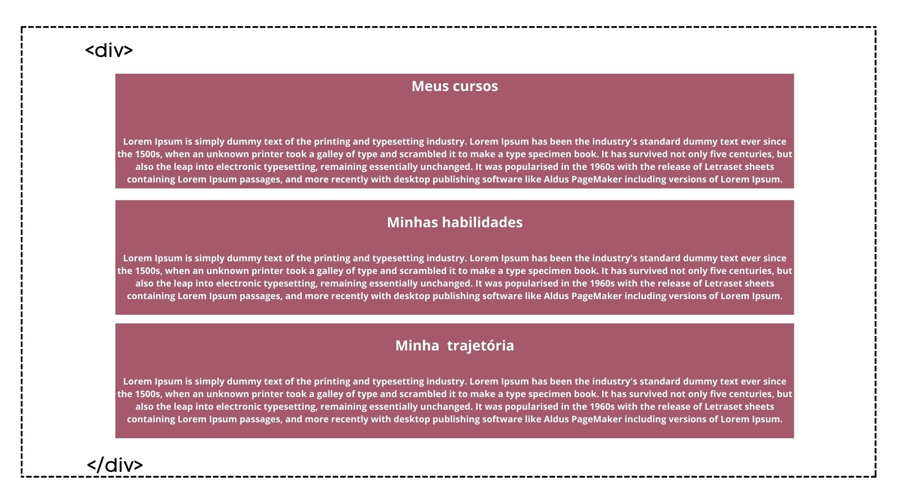
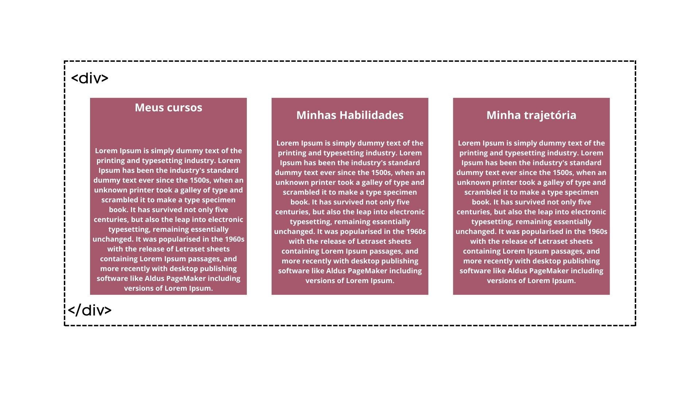

# Layouts 

## `A importância de criar o HTML pensando na disposição de layout que eu desejo`

## `Como resolver isto?`
### Como é o padrão do HTML

### Como queremos o layout

### `Existe uma propriedade que nos ajuda a resolver isso: Display`

display: flex;

Quando a gente usa display: flex, por debaixo dos panos a gente traz uma série de possíveis comportamentos do Flex Container.
Então estamos transformando nosso conjunto de tags num container flexível.

## Sites para ir além
[Origamid](https://origamid.com/projetos/flexbox-guia-completo/)

[Flexfroggy](https://flexboxfroggy.com/)

[Vídeos para aprender a jogar flexfroggy](https://www.youtube.com/watch?v=g23PsU2l5VM)